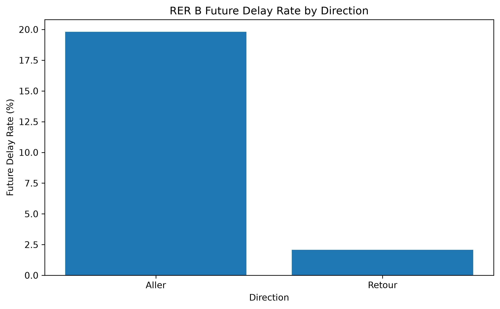
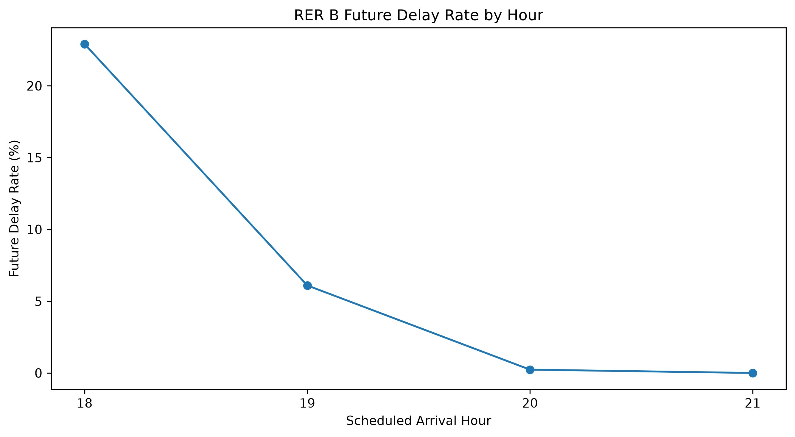
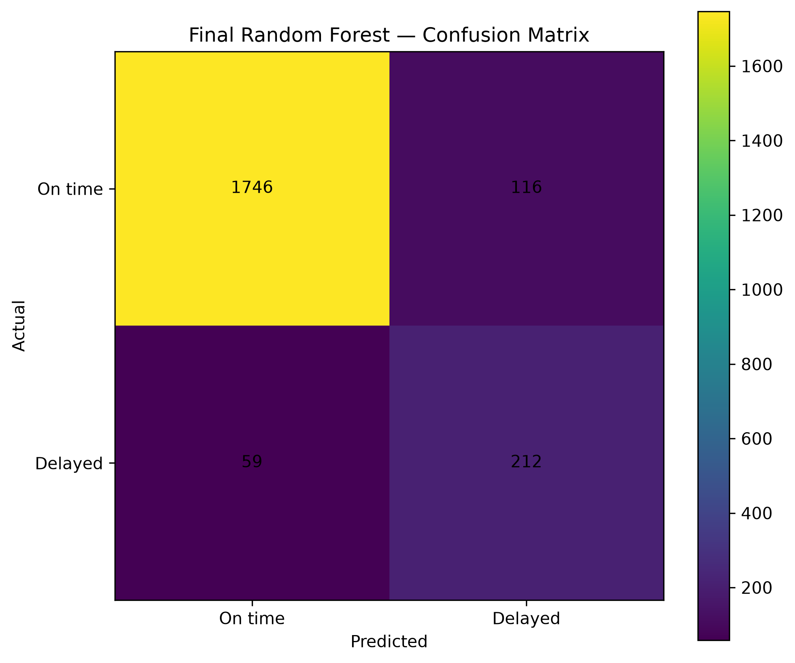
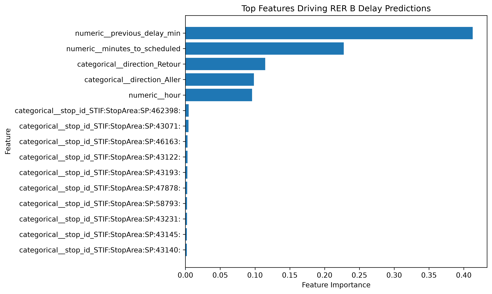

#  RER B Transit Delay Prediction & Early-Warning System

An end-to-end data science project that transforms real-time public transit data into a historical dataset and uses machine learning to predict future RER B train delays.

---

##  Project Overview

Public transportation delays are dynamic: a delay observed at one point in a journey can propagate to subsequent stops.

This project investigates whether real-time transit data can be transformed into predictive signals that identify trains at risk of future delays.

Using repeated **SIRI Lite real-time observations from Île-de-France Mobilités**, the project builds a historical dataset of RER B journeys and stop-level observations, engineers temporal and historical delay features, and trains a Random Forest classifier to predict whether a subsequent observation will be delayed.

The project also explores an **early-warning perspective**, where the objective is to identify developing delays before they reach a significant threshold.

### Key Question

> **Can real-time transit observations be used to predict future RER B delays accurately enough to support an early-warning system?**

---

##  Objectives

* Collect and structure real-time RER B transit observations.
* Transform repeated snapshots into a historical dataset.
* Analyze delay patterns across directions and time periods.
* Engineer features describing previous operational conditions.
* Predict whether a future journey-stop observation will be delayed.
* Evaluate the model using metrics appropriate for an imbalanced classification problem.
* Identify the factors that contribute most to delay predictions.
* Explore the trade-off between detecting delays and generating false alerts.

---

##  Data

### Data source

The project uses real-time public transportation information provided through the **Île-de-France Mobilités SIRI Lite API**.

The collected observations contain information such as:

* Journey identifier
* Line
* Direction
* Origin
* Destination
* Stop
* Scheduled arrival/departure
* Expected arrival/departure
* Operational status
* Collection timestamp

### Dataset

The collection process produced:

* **15,252 stop-level observations**
* Multiple observations of the same journey-stop combination
* Historical temporal information reconstructed from repeated snapshots
* **10,662 observations** available for the final modeling dataset

The target variable identifies whether the **next observed arrival** reaches a delay threshold of at least **2 minutes**.

---

##  Data Science Workflow

```text
Real-time SIRI Lite API
        ↓
Repeated snapshots
        ↓
Historical dataset
        ↓
Data cleaning
        ↓
Journey-stop history
        ↓
Feature engineering
        ↓
Exploratory analysis
        ↓
Chronological train/test split
        ↓
Random Forest
        ↓
Evaluation & interpretation
        ↓
Delay prediction / early warning
```

---

##  Data Preparation

The raw observations were transformed into a structured historical dataset.

### Main preprocessing steps

1. Converted timestamp fields to timezone-aware datetime values.
2. Calculated arrival and departure delays in minutes.
3. Created a unique journey-stop identifier.
4. Ordered observations chronologically.
5. Generated previous-observation delay features.
6. Created temporal features.
7. Created a future-delay prediction target.
8. Removed observations without sufficient historical information.

### Target definition

An observation is classified as delayed when:

```text
future arrival delay ≥ 2 minutes
```

This formulation allows the model to use information available at the current observation to predict a future delay.

---

##  Exploratory Analysis

The analysis examined how delay probability varies according to operational context.

### Main dimensions analyzed

* Direction of travel
* Scheduled arrival hour
* Previous observed delay
* Time remaining until the scheduled event
* Stop location

The results show that delay risk is not uniformly distributed across the network.





---

##  Machine Learning

### Model

The final predictive model is a **Random Forest classifier**.

Random Forest was selected because it can capture nonlinear relationships between operational variables while handling a mixture of numerical and categorical features.

### Features

The final model uses:

#### Numerical

* `previous_delay_min`
* `minutes_to_scheduled`
* `hour`
* `day_of_week`

#### Categorical

* `direction`
* `stop_id`

Categorical variables were encoded using one-hot encoding.

Numerical variables were imputed and standardized as part of the preprocessing pipeline.

### Class imbalance

Future delays represent a minority class in the modeling dataset.

To reduce the tendency of the model to favor the majority class, the Random Forest uses:

```python
class_weight="balanced"
```

---

##  Temporal Evaluation

A random train/test split would risk mixing observations from different points in time.

Instead, the dataset was sorted chronologically and divided into:

```text
Earlier observations → Training
Later observations   → Testing
```

This better reflects the real-world scenario:

> Train on historical observations → predict future observations.

---

#  Final Model Performance

The final Random Forest achieved:

| Metric        |      Score |
| ------------- | ---------: |
| **Accuracy**  | **91.80%** |
| **Precision** | **64.63%** |
| **Recall**    | **78.23%** |
| **F1-score**  | **70.78%** |

### Confusion Matrix



The model correctly identified:

* **212 of 271 delayed observations**
* **1,746 of 1,862 on-time observations**

It produced:

* **59 false negatives**
* **116 false positives**

The **78.23% recall** for the delayed class is particularly relevant for an early-warning application because it means the model detected the majority of future delays.

At the same time, the **64.63% precision** indicates that a substantial proportion of generated delay alerts corresponded to actual future delays.

---

##  Feature Importance

The Random Forest provides an interpretable view of which features contributed most strongly to its predictions.



### Most important predictors

| Feature                    | Importance |
| -------------------------- | ---------: |
| Previous delay             | **41.27%** |
| Minutes to scheduled event | **22.75%** |
| Direction — Retour         | **11.46%** |
| Direction — Aller          |  **9.85%** |
| Scheduled hour             |  **9.58%** |

The strongest signal is **previous delay**, which accounts for approximately 41% of total feature importance.

This suggests that delays tend to persist across successive observations of the same journey and stop.

Temporal context and direction also contribute substantially to the prediction.

---

##  Early-Warning Experiment

A separate early-warning experiment examined observations that were initially below the 2-minute delay threshold and asked whether they would later become delayed.

The experiment produced:

* **11,162 early-warning observations**
* **501 observations later becoming delayed**
* **4.49% positive rate**

The Random Forest achieved:

* **Recall: 88.73%**
* **Precision: 16.54%**
* **F1-score: 27.88%**
* **PR-AUC: 0.5452**

The probability threshold was then analyzed to demonstrate the operational trade-off between detecting more delays and generating fewer false alerts.

At a threshold selected to maintain approximately **80% recall**:

* Precision: **19.39%**
* Recall: **80.28%**
* F1-score: **31.23%**

At the threshold maximizing F1:

* Precision: **64.15%**
* Recall: **47.89%**
* F1-score: **54.84%**

This demonstrates that an operational warning system could choose its alert threshold according to the relative cost of missed delays versus false alerts.

---

##  Key Insights

### 1. Previous delays are the strongest predictor

The model's most important feature is the delay already observed at the previous observation.

This supports the intuition that railway delays can propagate along a journey.

### 2. Timing matters

The time remaining until the scheduled event and the scheduled hour both contribute significantly to predictions.

### 3. Direction matters

The model identifies meaningful differences between the two directions of travel.

### 4. Accuracy alone is not sufficient

Because delayed observations represent a minority class, accuracy can hide poor performance on the class of interest.

For this reason, the project emphasizes:

* Precision
* Recall
* F1-score
* Confusion matrix
* PR-AUC for the early-warning experiment

---

##  Limitations

The main limitation is the relatively short observation period.

The model therefore captures patterns present during the collection period and may not generalize equally well to:

* Different days
* Different seasons
* Major service disruptions
* Extreme weather
* Unusual passenger demand
* Infrastructure incidents

The current dataset also does not incorporate external operational factors such as weather, incidents, passenger volume, or network-wide disruptions.

---

##  Future Improvements

Potential extensions include:

* Collecting several weeks or months of historical observations.
* Incorporating weather data.
* Adding service disruption and incident information.
* Modeling network-wide delay propagation.
* Incorporating passenger demand.
* Testing Gradient Boosting / XGBoost / LightGBM.
* Developing time-series models.
* Building a real-time prediction API.
* Creating a dashboard for operational monitoring.
* Deploying the model as a live early-warning service.

---

##  Technologies

* **Python**
* **Pandas**
* **NumPy**
* **Matplotlib**
* **Scikit-learn**
* **Joblib**
* **SIRI Lite API**
* **Jupyter Notebook**

---

##  Project Structure

```text
transit-delay-prediction/
│
├── data/
│   ├── raw/
│   └── processed/
│       └── rer_b_delay_modeling_dataset.csv
│
├── figures/
│   ├── delay_rate_by_direction.png
│   ├── delay_rate_by_hour.png
│   ├── confusion_matrix.png
│   └── feature_importance.png
│
├── models/
│   └── rer_b_delay_random_forest.joblib
│
├── notebooks/
│   └── RER_B_Delay_Prediction_Final.ipynb
│
├── .gitignore
├── requirements.txt
└── README.md
```

---

##  Reproducibility

Clone the repository and install the required dependencies:

```bash
pip install -r requirements.txt
```

Then open:

```text
notebooks/RER_B_Delay_Prediction_Final.ipynb
```

The notebook contains the complete workflow from historical data preparation through model evaluation.

---

##  Final Takeaway

This project demonstrates an end-to-end data science workflow applied to a real-world transportation problem:

> **Real-time data → Data engineering → Historical reconstruction → Feature engineering → Exploratory analysis → Machine learning → Evaluation → Interpretation**

The final Random Forest achieved **91.80% accuracy, 64.63% precision, 78.23% recall, and a 70.78% F1-score**, showing that real-time transit observations contain meaningful predictive signals for future RER B delays.

The project also demonstrates how machine-learning probability thresholds can be adjusted depending on whether the operational priority is **catching more delays** or **generating more reliable warnings**.
